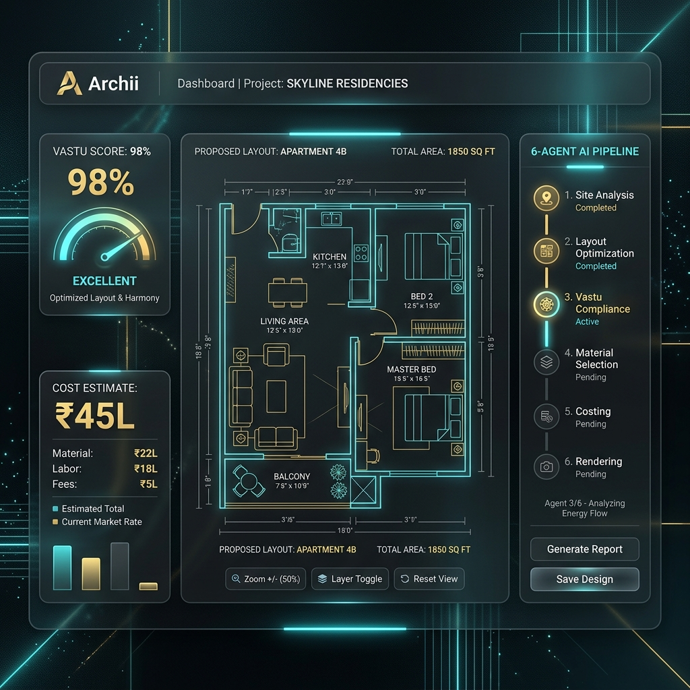

# 🏗️ Archii (वास्तु AI)


### AI-Powered Architectural Design & Vastu Shastra Platform

Archii is a sophisticated, multi-agent AI pipeline designed to automate residential floor plan generation while ensuring strict compliance with **Vastu Shastra** and **Indian Municipal Building Codes**. By simply inputting plot dimensions and preferences, Archii generates professional-grade architectural drawings, cost estimates, and compliance reports in seconds.

---

## ✨ Key Features

- **🤖 6-Agent AI Pipeline**: Orchestrates Input Parsing, Spatial Planning, SVG Rendering, Vastu Criticism, Cost Estimation, and Furniture AI in a seamless sequence.
- **🕉️ Vastu Shastra Compliance**: Automatically audits 14+ Vastu rules per plan, including directional room placement (NE/SE/SW zones) and compass orientation.
- **🇮🇳 Municipal Code Validation**: Checks against BBMP, GHMC, PCMC, BDA, and other major Indian city codes for FAR limits, setbacks, and green coverage.
- **🎨 Interactive Design Studio**: Toggle between **Blueprint**, **Dark**, and **Light** themes. High-fidelity SVG visualization with room labels and sun path overlays.
- **💰 Cost & BOM Estimation**: Generates region-specific construction cost breakdowns, bills of materials (BOM), and estimated project timelines.
- **🛋️ Furniture Layout AI**: Intelligently places furniture within generated rooms to help visualize living spaces.
- **📄 Professional Exports**: Export your designs as high-quality **SVG**, **PNG**, or comprehensive **PDF** reports including Vastu audits and material lists.
- **👨‍👩‍👧‍👦 "Explain to My Parents"**: A unique feature that translates complex architectural data into simple, relatable terms for non-technical family members.

---

## 🛠️ Technology Stack

| Layer | Technology |
|---|---|
| **Framework** | [Next.js 15](https://nextjs.org/) (React 19) |
| **Styling** | Vanilla CSS (Modern CSS Variables + Keyframe Animations) |
| **Database/Auth** | [Supabase](https://supabase.com/) |
| **AI Models** | Anthropic Claude 3.5, Google Gemini 2.0, Llama 3.3 (via Groq), NVIDIA NIM |
| **Visualization** | SVG + React Canvas (Blueprints), Lucide Icons |
| **PDF Generation** | `jsPDF` |

---

## 🚀 AI Provider Fallback Chain

Archii is built for reliability. It uses a 4-tier fallback system to ensure designs are always generated:
1. **Claude 3.5 Sonnet** (Primary - Highest Accuracy)
2. **Gemini 2.0 Flash** (Fast & Efficient)
3. **Llama 3.3 70B** (via Groq - Ultra Fast)
4. **Llama 3.1 405B** (via NVIDIA NIM)

---

## 🏁 Getting Started

### Prerequisites
- Node.js 18+
- Supabase Project
- API Keys for at least one AI provider (Anthropic, Google, or Groq)

### Installation

1. **Clone the repository:**
   ```bash
   git clone https://github.com/0nouman0/Archii.git
   cd Archii
   ```

2. **Install dependencies:**
   ```bash
   npm install
   ```

3. **Configure Environment Variables:**
   Create a `.env.local` file based on `.env.local.example` and add your keys:
   ```env
   NEXT_PUBLIC_SUPABASE_URL=your_url
   NEXT_PUBLIC_SUPABASE_ANON_KEY=your_key
   ANTHROPIC_API_KEY=your_key
   GOOGLE_GENERATIVE_AI_API_KEY=your_key
   GROQ_API_KEY=your_key
   ```

4. **Run the development server:**
   ```bash
   npm run dev
   ```
   Open [http://localhost:3000](http://localhost:3000) to see the studio.

---

## 🗺️ Project Structure

- `/app`: Next.js App Router pages and API routes.
- `/components`: Reusable UI components (Modals, Sidebars, Canvas).
- `/lib`: Core logic engines (Layout Engine, Prompts, Vastu Rules).
- `/public`: Static assets and icons.
- `/scripts`: Utility scripts for data processing.

---

## 📜 License

This project is licensed under the MIT License - see the [LICENSE](LICENSE) file for details.

---

Built with ❤️ for Indian Residential Architecture.
